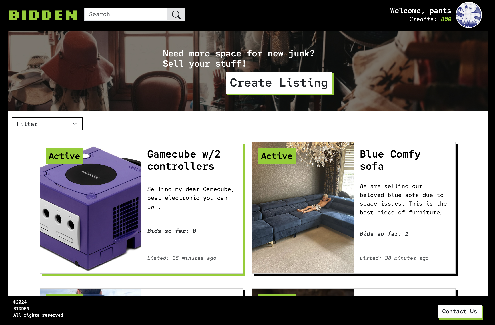

# Bidden

Bubble is an auction site, developed as part of the Semester Exam 2 at Noroff. It allows users to create, view, update, and delete listings, make bids on others items, view their credits, and also view and edit their profile.

## Features

- **User Authentication**: Users with `@noroff.no` or `@stud.noroff.no` email addresses can register and login to their profiles.
- **Listings Feed**: Users can view a feed of the posted listings.
- **Listing Filtering**: Users can filter the post feed based on if they are active or not.
- **Listing Search**: Users can search for specific listings within the listing feed.
- **View Single Listing**: Users can view the content of a single listing by its ID.
- **Create Listing**: Logged-in users can create a new listing.
- **Update Listing**: Users can update the content of their own listings.
- **Delete Listing**: Users can delete their own listings.
- **Profile Editing**: Users can edit their profile media and bio.
- **Profile with Listings and Wins**: Users can view a profile which includes the wins and listings, of a user, by name .

##Demo

Visit a live demo here https://bidden.netlify.app




## Setup

1. Clone the repository:

   ```bash
   git clone https://github.com/thislily/Bidden
   ```

2. Navigate to the project directory:

   ```bash
   cd bidden
   ```

3. Install dependencies:

   ```bash
   npm install
   ```

5. Build the project:
   ```bash
   npm run build
    ```

4. Watch the project:
   ```bash
   npm run watch
   ```

## Technologies Used

- JavaScript
- HTML
- CSS
- SCSS
- Figma
- Trello
- Placker (just the plugin for Trello)

## Credits

Bidden is developed by Lily Watson as part of the Semester Exam 2 at Noroff.

## Contact Information
For any inquiries or feedback, feel free to reach out to Lily Watson at lilywatson.dev@gmail.com.
