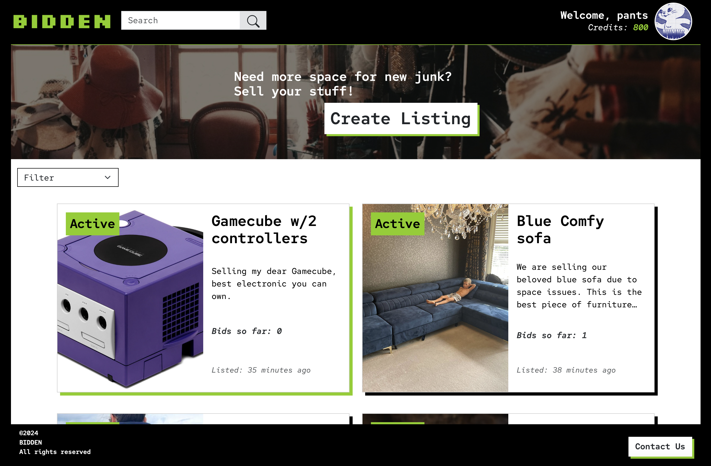

# Bidden



## 🚀 About the Project
Bidden is an auction site developed as part of the Semester Exam 2 at Noroff. It allows users to create, view, update, and delete listings, make bids on items, view their credits, and manage their profiles.

## 🎨 Features
- 🔐 **User Authentication** – Users with `@noroff.no` or `@stud.noroff.no` email addresses can register and log in.
- 📜 **Listings Feed** – Browse a feed of all posted listings.
- 🔍 **Listing Search & Filtering** – Search for specific listings and filter active or inactive posts.
- 📄 **View Single Listing** – Detailed view of a listing, including bids.
- ➕ **Create Listing** – Logged-in users can create new listings.
- ✏️ **Update & Delete Listings** – Users can edit or remove their own listings.
- 🏆 **Profile with Listings & Wins** – Users can view their profile, including their posted listings and winning bids.
- 🖼 **Profile Editing** – Users can update their profile media and bio.

## 🌍 Live Demo
Visit the live site: [Bidden](https://bidden.netlify.app)

## 🛠️ Tech Stack
- **Frontend**: JavaScript, HTML, CSS, SCSS
- **Design & Planning**: Figma, Trello, Placker (Trello plugin)

## 📦 Installation & Setup
To run this project locally, follow these steps:

### 1️⃣ Clone the Repository
```bash
git clone https://github.com/thislily/Bidden.git
cd bidden
```

### 2️⃣ Install Dependencies
```bash
npm install
```

### 3️⃣ Build the Project
```bash
npm run build
```

### 4️⃣ Start Development Mode
```bash
npm run watch
```

## 📬 Contact
For any inquiries or feedback, feel free to reach out:
📧 [lilywatson.dev@gmail.com](mailto:lilywatson.dev@gmail.com)

---
**Made by Lily Watson**


